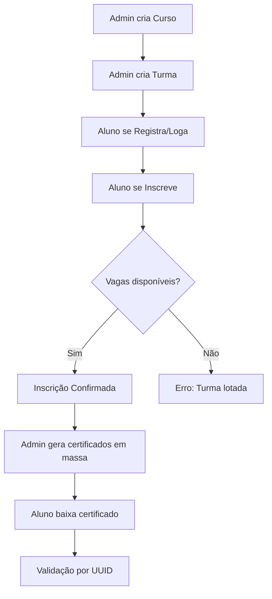

# 🎓 CertifyAPI - Sistema de Gerenciamento de Certificados

API completa para gerenciamento de cursos, turmas, inscrições e emissão de certificados digitais com sistema anti-fraude baseado em UUID.

## 📋 Índice

- [Visão Geral](#visão-geral)
- [Funcionalidades](#funcionalidades)
- [Tecnologias](#tecnologias)
- [Instalação](#instalação)
- [Configuração](#configuração)
- [Uso](#uso)
- [Estrutura do Projeto](#estrutura-do-projeto)
- [API Endpoints](#api-endpoints)
- [Fluxos de Uso](#fluxos-de-uso)
- [Templates de Certificados](#templates-de-certificados)

## 🎯 Visão Geral

CertifyAPI é um sistema completo para instituições de ensino que permite:
- Gerenciar cursos e turmas com controle de vagas
- Inscrições de alunos (com autenticação)
- Geração em massa de certificados personalizados
- Validação de autenticidade via UUID
- Templates customizáveis por turma

## ✨ Funcionalidades

### Para Alunos (Público/Autenticado)
- ✅ Cadastro e Login de alunos
- ✅ Visualizar turmas disponíveis
- ✅ Inscrever-se em turmas (requer login)
- ✅ Gerenciar suas inscrições
- ✅ Buscar certificados por CPF (público)
- ✅ Download de certificados próprios (requer login)
- ✅ Validar autenticidade de certificados (público)

### Para Administradores
- ✅ Criar e gerenciar cursos
- ✅ Criar turmas com controle de vagas
- ✅ Definir template de certificado por turma
- ✅ Abrir/fechar inscrições de turmas
- ✅ Visualizar alunos por turma
- ✅ Gerar certificados em massa por turma (Download ZIP)

## 🛠️ Tecnologias

- **Backend:** FastAPI (Python 3.8+)
- **Banco de Dados:** SQLite (SQLAlchemy ORM)
- **Autenticação:** JWT (JSON Web Tokens)
- **Geração de PDF:** ReportLab
- **Validação:** Pydantic
- **Documentação:** Swagger/OpenAPI automático

## 📦 Instalação

### Pré-requisitos
- Python 3.8 ou superior
- pip (gerenciador de pacotes Python)

### Passo a Passo

1. **Clone o repositório**
```bash
git clone https://github.com/ualcz/CertifyAPI.git
cd CertifyAPI
```

2. **Crie um ambiente virtual**
```bash
python -m venv venv

# Windows
venv\Scripts\activate

# Linux/Mac
source venv/bin/activate
```

3. **Instale as dependências**
```bash
pip install -r requirements.txt
```

4. **Execute as migrações**
```bash
# Migração para sistema de turmas
python migrate_to_classes.py
```

5. **Inicie o servidor**
```bash
uvicorn app.main:app --reload
```

O servidor estará disponível em: `http://localhost:8000`

## ⚙️ Configuração

### Variáveis de Ambiente

Crie um arquivo `.env` na raiz do projeto:

```env
# Segurança
SECRET_KEY=sua-chave-secreta-aqui-muito-segura
ALGORITHM=HS256
ACCESS_TOKEN_EXPIRE_MINUTES=30

# Banco de Dados
DATABASE_URL=sqlite:///./certify.db

# Admin Padrão
FIRST_SUPERUSER=admin@example.com
FIRST_SUPERUSER_PASSWORD=admin123
```

### Usuário Admin Padrão

- **Email:** `admin@example.com`
- **Senha:** `admin123`

⚠️ **IMPORTANTE:** Altere a senha padrão em produção!

## 🚀 Uso

### Interface Web

Acesse `http://localhost:8000/static/index.html` para a interface de teste.

### Documentação Interativa

- **Swagger UI:** `http://localhost:8000/docs`
- **ReDoc:** `http://localhost:8000/redoc`
- **Documentação Técnica:** [API_DOCS.md](API_DOCS.md)

### Exemplo Rápido

#### 1. Login como Admin
```bash
curl -X POST "http://localhost:8000/api/v1/login/access-token" \
  -H "Content-Type: application/x-www-form-urlencoded" \
  -d "username=admin@example.com&password=admin123"
```

#### 2. Criar um Curso
```bash
curl -X POST "http://localhost:8000/api/v1/courses/" \
  -H "Authorization: Bearer SEU_TOKEN_ADMIN" \
  -H "Content-Type: application/json" \
  -d '{
    "name": "Python Avançado",
    "description": "Curso completo de Python",
    "workload": 40
  }'
```

#### 3. Criar uma Turma
```bash
curl -X POST "http://localhost:8000/api/v1/classes/" \
  -H "Authorization: Bearer SEU_TOKEN_ADMIN" \
  -H "Content-Type: application/json" \
  -d '{
    "course_id": 1,
    "name": "Turma 2024.1",
    "total_slots": 30,
    "is_open": true,
    "certificate_template": "modern"
  }'
```

#### 4. Fluxo do Aluno

**4.1 Registrar Aluno**
```bash
curl -X POST "http://localhost:8000/api/v1/students/register" \
  -H "Content-Type: application/json" \
  -d '{
    "name": "João Silva",
    "email": "joao@example.com",
    "cpf": "12345678900",
    "password": "senha123"
  }'
```

**4.2 Login do Aluno**
```bash
curl -X POST "http://localhost:8000/api/v1/students/login" \
  -H "Content-Type: application/json" \
  -d '{
    "email": "joao@example.com",
    "password": "senha123"
  }'
```

**4.3 Inscrever-se na Turma**
```bash
curl -X POST "http://localhost:8000/api/v1/enrollments/?class_id=1" \
  -H "Authorization: Bearer SEU_TOKEN_ALUNO"
```

#### 5. Gerar Certificados da Turma (Admin)
```bash
# Retorna um arquivo ZIP com todos os PDFs
curl -X POST "http://localhost:8000/api/v1/certificates/bulk-class?class_id=1" \
  -H "Authorization: Bearer SEU_TOKEN_ADMIN" \
  --output certificados.zip
```

## 📁 Estrutura do Projeto

```
CertifyAPI/
├── app/
│   ├── api/
│   │   └── v1/
│   │       ├── endpoints/
│   │       │   ├── auth.py          # Autenticação (Admin e Aluno)
│   │       │   ├── courses.py       # Gerenciamento de cursos
│   │       │   ├── classes.py       # Gerenciamento de turmas
│   │       │   ├── students.py      # Perfil e certificados do aluno
│   │       │   ├── enrollments.py   # Inscrições em turmas
│   │       │   ├── certificates.py  # Geração de certificados
│   │       │   └── validate.py      # Validação de certificados
│   │       └── api.py               # Router principal
│   ├── core/
│   │   ├── config.py                # Configurações
│   │   └── security.py              # JWT e hashing
│   ├── db/
│   │   ├── base.py                  # Base do SQLAlchemy
│   │   └── session.py               # Sessão do banco
│   ├── models/                      # Modelos do banco de dados
│   │   ├── user.py
│   │   ├── course.py
│   │   ├── class_model.py
│   │   ├── student.py
│   │   ├── enrollment.py
│   │   └── certificate.py
│   ├── schemas/                     # Schemas Pydantic
│   │   ├── user.py
│   │   ├── course.py
│   │   ├── class_schema.py
│   │   ├── student.py
│   │   ├── enrollment.py
│   │   └── certificate.py
│   ├── services/
│   │   └── pdf_service.py           # Geração de PDFs
│   ├── static/
│   │   └── index.html               # Interface de teste
│   └── main.py                      # Aplicação principal
├── generated_certificates/          # PDFs gerados
├── migrate_to_classes.py            # Migração de turmas
├── requirements.txt
└── README.md
```

## 🔌 API Endpoints

### Autenticação
- `POST /api/v1/login/access-token` - Login Admin (retorna token)
- `POST /api/v1/students/register` - Registrar novo aluno
- `POST /api/v1/students/login` - Login Aluno (retorna token)

### Cursos (Courses)
- `GET /api/v1/courses/` - Listar cursos (público)
- `POST /api/v1/courses/` - Criar curso (admin)
- `GET /api/v1/courses/{id}` - Obter curso (admin)

### Turmas (Classes)
- `POST /api/v1/classes/` - Criar turma (admin)
- `GET /api/v1/classes/{id}` - Obter turma (público)
- `GET /api/v1/classes/course/{course_id}` - Listar turmas de um curso (público)
- `GET /api/v1/classes/{id}/students` - Listar alunos da turma (admin)
- `PUT /api/v1/classes/{id}/toggle` - Abrir/fechar inscrições (admin)
- **Novos Campos:** `start_date` e `end_date` (opcionais) para definir período da turma.

### Inscrições (Enrollments)
- `GET /api/v1/enrollments/classes/available` - Listar turmas disponíveis (aluno auth)
- `POST /api/v1/enrollments/?class_id={id}` - Inscrever-se em turma (aluno auth)
- `GET /api/v1/enrollments/me` - Listar minhas inscrições (aluno auth)
- `DELETE /api/v1/enrollments/{id}` - Cancelar inscrição (aluno auth)

### Alunos (Students)
- `GET /api/v1/students/me` - Perfil do aluno (aluno auth)
- `GET /api/v1/students/me/dashboard` - Dashboard do aluno (aluno auth)
- `GET /api/v1/students/me/certificates` - Meus certificados (aluno auth)
- `GET /api/v1/students/cpf/{cpf}/certificates` - Buscar certificados por CPF (público)

### Certificados (Certificates)
- `POST /api/v1/certificates/bulk-class?class_id={id}` - Gerar em massa e baixar ZIP (admin)
- `GET /api/v1/certificates/me/{id}/download` - Download do meu certificado (aluno auth)

### Validação
- `GET /api/v1/validate/{uuid}` - Validar certificado (público)

## 🔄 Fluxos de Uso

### Fluxo Completo - Do Curso ao Certificado



### Fluxo de Inscrição

1. **Aluno acessa a interface**
2. **Faz cadastro ou login**
3. **Visualiza turmas disponíveis** (`/enrollments/classes/available`)
4. **Escolhe uma turma e se inscreve** (`/enrollments/`)
5. **Sistema verifica:**
   - Turma existe e está aberta?
   - Há vagas disponíveis?
   - Aluno já está inscrito?
6. **Inscrição confirmada** (Vaga decrementada)

### Fluxo de Geração de Certificados

1. **Admin faz login**
2. **Acessa lista de alunos da turma**
3. **Gera certificados em massa** (`/bulk-class`)
4. **Sistema:**
   - Gera PDFs para todos os alunos da turma
   - Cria arquivo ZIP contendo todos os PDFs
   - Retorna o ZIP para download
5. **Admin distribui ou Alunos baixam individualmente** via painel do aluno.

## 🎨 Templates de Certificados

### Templates Disponíveis

Os templates são configurados no momento da criação da **Turma** (`certificate_template`).

#### 1. Default (Padrão)
- Estilo profissional
- Bordas azul e cinza
- Ideal para cursos corporativos

#### 2. Modern (Moderno)
- Gradiente roxo/azul
- Design minimalista
- Perfeito para cursos de tecnologia

#### 3. Classic (Clássico)
- Bordas douradas ornamentadas
- Estilo tradicional acadêmico
- Ideal para cursos formais

### Dados Incluídos no Certificado

Todos os templates incluem:
- ✅ Nome completo do aluno
- ✅ CPF do aluno
- ✅ Nome do curso
- ✅ Descrição do curso
- ✅ Carga horária
- ✅ Data de emissão
- ✅ UUID de validação
- ✅ Data de emissão

### 🆕 Como Adicionar Novos Templates

O sistema suporta templates em HTML/CSS (convertidos para PDF). Para adicionar um novo modelo:

1. Crie um arquivo `.html` em `app/templates/certificates/` (ex: `meu_template.html`).
2. Use HTML e CSS para desenhar o certificado.
3. Use variáveis do Jinja2 para os dados dinâmicos:
   - `{{ student_name }}`
   - `{{ student_cpf }}`
   - `{{ course_name }}`
   - `{{ course_workload }}`
   - `{{ issue_date }}`
   - `{{ validation_uuid }}`
4. O nome do arquivo (sem extensão) será o ID do template (ex: `meu_template`).
5. Use este ID ao criar uma Turma.

Exemplo de estrutura HTML básica:
```html
<div style="width: 297mm; height: 210mm; padding: 20px; border: 10px solid #333;">
    <h1>Certificado</h1>
    <p>Certificamos que {{ student_name }} concluiu o curso {{ course_name }}</p>
    <p>Carga horária: {{ course_workload }} horas</p>
    <p>Código: {{ validation_uuid }}</p>
</div>
```

Este projeto está sob a licença MIT. Veja o arquivo LICENSE para mais detalhes.

## 🤝 Contribuindo

Contribuições são bem-vindas! Por favor:

1. Fork o projeto
2. Crie uma branch para sua feature (`git checkout -b feature/AmazingFeature`)
3. Commit suas mudanças (`git commit -m 'Add some AmazingFeature'`)
4. Push para a branch (`git push origin feature/AmazingFeature`)
5. Abra um Pull Request

## 📧 Suporte

Para suporte, abra uma issue no GitHub.
